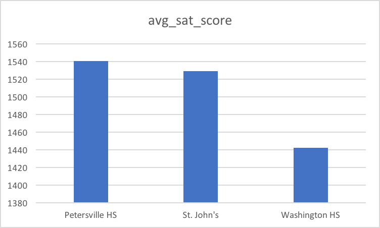
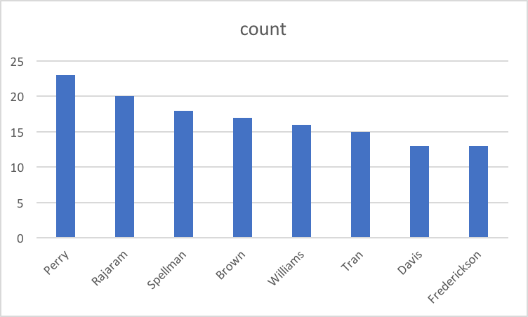
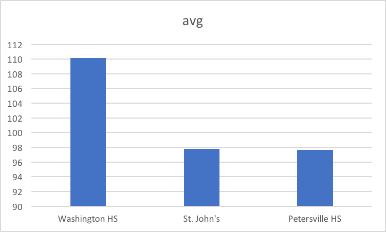
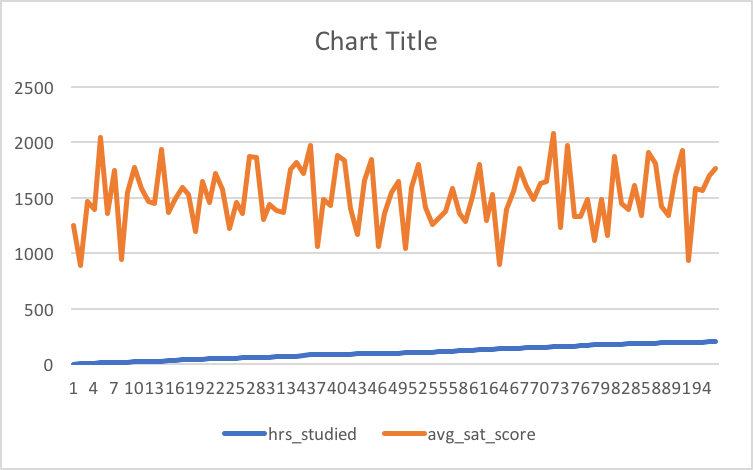
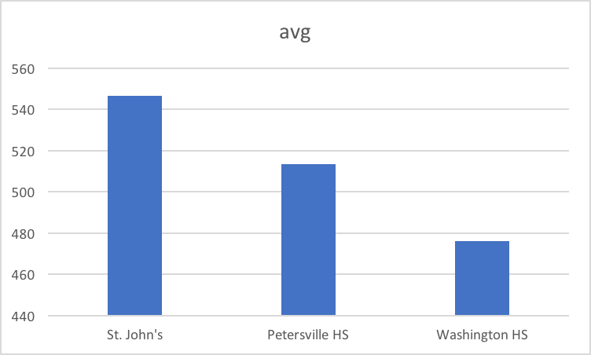

## Description of datasets.sat_scores
The SAT is a test widely taken by students before they apply for universities in USA. This test has three components, writing test, verbal test and math test. By analyzing this dataset, I want to find factors that may affect students’ test scores. This dataset contains 3 categorical data, including school name, teachers' names and student ID, as well as 4 numerical data including SAT writing scores, SAT verbal scores, SAT math scores and the hours that each student studied for the test. 

## question #1
Which school has the highest average SAT writing score?

```sql
Select school, avg(sat_math + sat_verbal + sat_writing) as avg_sat_score
  from datasets.sat_scores
  group by school
  order by avg_sat_score desc
```


## question #2
Which teacher has the most students?

```sql
Select teacher,
Count (student_id)
From datasets.sat_scores
group by teacher
Order by count desc
```


## question #3
Which school has the most hard-working students based on average study hours?

```sql
Select school, avg(hrs_studied)
from datasets.sat_scores
group by school
Order by avg desc
```


## question #4
Is there a correlation between hours studied and the total test score?

```sql
Select hrs_studied, sum(sat_math + sat_verbal + sat_writing) as total_sat_score
  from datasets.sat_scores
  group by hrs_studied
  order by hrs_studied ASC
```


## question #5
Which school has students that is good at math based on the average math score?

```sql
Select school, avg(sat_math)
from datasets.sat_scores
group by school
Order by avg desc
```

